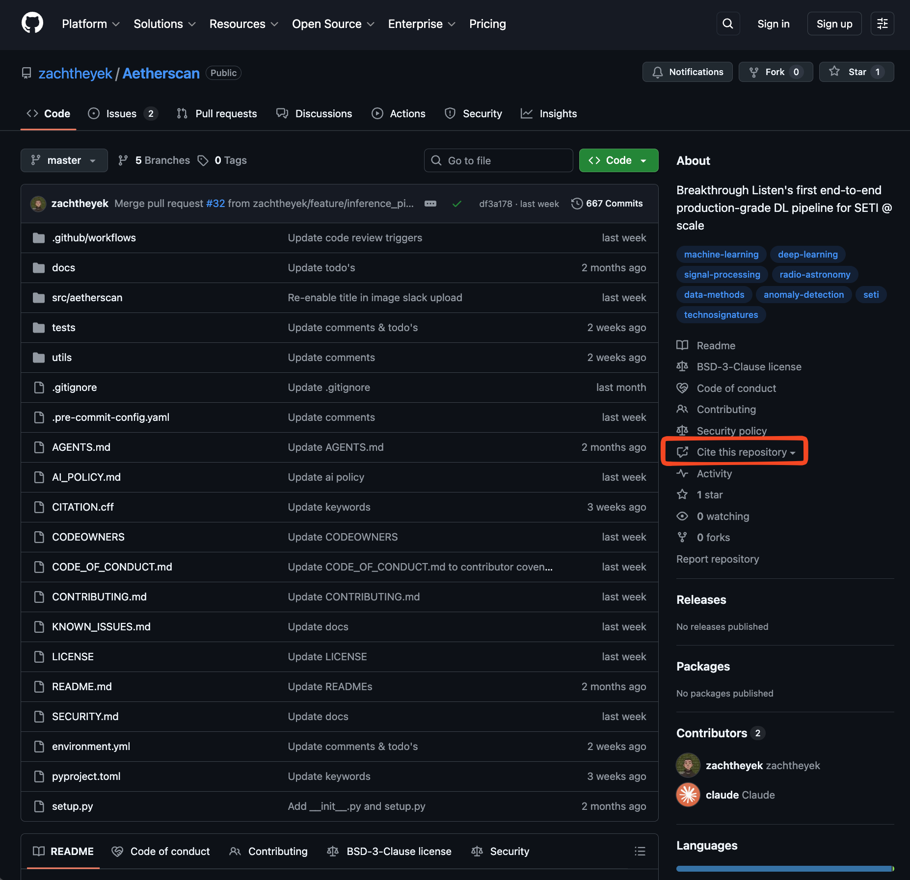

<h1>
<p align="center">
  📡 Aetherscan 📡
</h1>
<p align="center">
  
</p>
  <p align="center">
    Breakthrough Listen's first end-to-end production-grade deep learning pipeline for SETI @ scale
    <br />
    <br />
    <a href="LICENSE"></a>
    <a href="https://www.python.org/"></a>
    <a href="https://www.tensorflow.org/"></a>
    <a href="https://developer.nvidia.com/cuda-toolkit"></a>
  </p>
</p>

---

## Overview

Aetherscan is a deep learning pipeline for detecting anomalies in radio spectrograms with technosignature-like characteristics. It combines a beta-VAE (for dimensionality reduction/feature extraction) with a Random Forest ensemble (for candidate detection), trained on ~30m unique cadence snippets using a composite loss that balances reconstruction, KL divergence, and true/false clustering. The pipeline is designed with performance in mind, by default running single-node distributed training & inference, using zero-copy parallelism during pre- and post-processing.

The model architecture is based on [Ma et al. 2023](https://arxiv.org/abs/2301.12670) ("_A deep-learning search for technosignatures from 820 unique stars_"), extending the research prototype into a production-ready system capable of near real-time inference.

### Key Features

- **Data-parallel distributed training/inference** — Gradients synchronized via TensorFlow MirroredStrategy with NCCL AllReduce. Gradient accumulation allows for larger effective batch sizes under low VRAM constraints. Generator-based distributed datasets stream data from CPU to GPU on-demand, further lowering VRAM pressure.
- **Cadence-aware clustering loss** — The composite loss combines standard beta-VAE reconstruction and KL divergence (β-weighted), with true/false clustering (α-weighted) that encourages ON-ON and OFF-OFF proximity + ON-OFF separation for true signals, and uniform clustering for false signals. This implicitly teaches the model to mimick traditional signal locality filters.
- **Curriculum-based training regime** — Progressive SNR difficulty schedules paired with adaptive learning rates that decay on validation plateaus but reset each round, enabling aggressive fine-tuning within difficulty stages while preserving exploration capacity across rounds. Per-round checkpointing and automatic retry with constant backoff ensure graceful recovery from transient failures.
- **Multiprocess-accelerated data pipelines with zero-copy parallelism** — Preprocessing and data generation modules execute in parallel worker pools, while shared memory architecture enables inter-process communication without serialization overhead. Custom SIGTERM handlers in workers ensure proper resource cleanup even during interruptions.
- **Infrastructure services** — Thread-safe singletons for async database writes (queue-based SQLite), multiprocess logging (QueueListener pattern with Slack webhooks), background resource monitoring, and centralized resource lifecycle management with graceful shutdown handling.

---

## Installation

### System Requirements

Aetherscan's _default_ configs have been tested on machines with the following _minimum_ specifications:

**Training**

- Ubuntu 24.04
- 1x NVIDIA GPU, 9GB VRAM, CUDA 12.2
- 350 GB RAM

**Inference**

- Ubuntu 24.04
- 1x NVIDIA GPU, XGB VRAM, CUDA 12.2
- X GB RAM

As the software matures, more detailed system requirements will be made available to the user.

> [!Tip]
> If you're running into resource bottlenecks, consider adjusting the appropriate config values (e.g. lower `--num-samples-beta-vae` or `--signal-injection-chunk-size` if RAM is the limiting factor).

### Run From Source

> [!NOTE]
> Aetherscan currently only supports running from source.
> Installation via pip and containerized distributions will be made available in a later release.

**1. Clone the repository**

```bash
git clone https://github.com/zachtheyek/Aetherscan.git
cd Aetherscan
```

**2. Create conda environment**

```bash
conda env create -f environment.yml
conda activate aetherscan
```

**3. Set environment variables**

```bash
# (Recommended) from .env file — see SECURITY.md
source .env
```

```bash
# (Alternative) manual configuration

# If none specified, defaults to /datax/scratch/zachy/{data|models|outputs}/aetherscan
# Note, CLI flags (--data-path, --model-path, --output-path) overrides environment variables
export AETHERSCAN_DATA_PATH="/path/to/data"
export AETHERSCAN_MODEL_PATH="/path/to/models"
export AETHERSCAN_OUTPUT_PATH="/path/to/outputs"

# If none specified, Slack integration is automatically disabled
export SLACK_BOT_TOKEN="xoxb-..."
export SLACK_CHANNEL="#aetherscan-logs"
```

**4. Run pipeline**

```bash
# Use inline environment variables to create a temporary environment frame that applies to the current command and subsequent descendants
# Necessary for proper parent→child environment inheritance in multiprocess worker pools
SLACK_BOT_TOKEN=$SLACK_BOT_TOKEN SLACK_CHANNEL=$SLACK_CHANNEL PYTHONPATH=src \
  python -m aetherscan.main {train|inference} \
  --save-tag final_v1
```

---

## Usage Examples

> [!NOTE]
> `main.py` is the designated pipeline entry point.
> Non-development workflows should avoid directly calling other scripts/modules.

> [!NOTE]
> The following section will omit writing the inline environment variables for brevity.
> As well, `PYTHONPATH=src python -m aetherscan.main` will be shortened to simply `aetherscan`.
> NOTE TO ZACH: update README once local builds with `pip install -e .` are working as expected.

### Training

```bash
# Default training run
aetherscan train

# Training with custom parameters
aetherscan train \
    --train-files real_filtered_LARGE_HIP110750.npy real_filtered_LARGE_HIP13402.npy real_filtered_LARGE_HIP8497.npy \
    --num-training-rounds 20 \
    --epochs-per-round 100 \
    --curriculum-schedule exponential \
    --save-tag test_v1

# Resume from checkpoint
aetherscan train \
    --load-dir checkpoints \
    --load-tag round_10 \
    --save-tag test_v1
```

### Inference

```bash
# Default inference run
aetherscan inference

# Run inference with custom parameters
aetherscan inference \
    --test-files real_filtered_LARGE_test_HIP15638.npy \
    --classification-threshold 0.9
```

---

## CLI Reference

Aetherscan uses a hierarchical configuration system with dataclass-based configs, whose state can be modified both at command time and runtime. At command time, the user can specify values via:

1. **Defaults** - Defined in `src/aetherscan/config.py`
2. **Environment variables** - For paths and secrets
3. **CLI arguments** - Override defaults on startup

At runtime, the singleton `Config` instance can be accessed via `get_config()` and modified programmatically.

### Top-Level Help

Aetherscan supports both training and inference, invoked using the first positional argument.

```
usage: [-h] {train,inference} ...

Aetherscan Pipeline -- Breakthrough Listen's first end-to-end production-grade DL pipeline for SETI @ scale

positional arguments:
  {train,inference}
                        Command to execute
    train               Execute training pipeline
    inference           Execute inference pipeline

options:
  -h, --help            show this help message and exit
```

### Train Command Help

The Aetherscan training pipeline exposes the following CLI flags to the user:

```
usage:  train [-h] [--data-path DATA_PATH] [--model-path MODEL_PATH]
              [--output-path OUTPUT_PATH] [--vae-latent-dim VAE_LATENT_DIM]
              [--vae-dense-layer-size VAE_DENSE_LAYER_SIZE]
              [--vae-kernel-size VAE_KERNEL_SIZE VAE_KERNEL_SIZE]
              [--vae-beta VAE_BETA] [--vae-alpha VAE_ALPHA]
              [--rf-n-estimators RF_N_ESTIMATORS]
              [--rf-bootstrap RF_BOOTSTRAP]
              [--rf-max-features RF_MAX_FEATURES] [--rf-n-jobs RF_N_JOBS]
              [--rf-seed RF_SEED] [--num-observations NUM_OBSERVATIONS]
              [--width-bin WIDTH_BIN] [--downsample-factor DOWNSAMPLE_FACTOR]
              [--time-bins TIME_BINS] [--freq-resolution FREQ_RESOLUTION]
              [--time-resolution TIME_RESOLUTION]
              [--num-target-backgrounds NUM_TARGET_BACKGROUNDS]
              [--background-load-chunk-size BACKGROUND_LOAD_CHUNK_SIZE]
              [--max-chunks-per-file MAX_CHUNKS_PER_FILE]
              [--train-files TRAIN_FILES [TRAIN_FILES ...]]
              [--num-training-rounds NUM_TRAINING_ROUNDS]
              [--epochs-per-round EPOCHS_PER_ROUND]
              [--num-samples-beta-vae NUM_SAMPLES_BETA_VAE]
              [--num-samples-rf NUM_SAMPLES_RF]
              [--train-val-split TRAIN_VAL_SPLIT]
              [--per-replica-batch-size PER_REPLICA_BATCH_SIZE]
              [--effective-batch-size EFFECTIVE_BATCH_SIZE]
              [--per-replica-val-batch-size PER_REPLICA_VAL_BATCH_SIZE]
              [--signal-injection-chunk-size SIGNAL_INJECTION_CHUNK_SIZE]
              [--snr-base SNR_BASE] [--initial-snr-range INITIAL_SNR_RANGE]
              [--final-snr-range FINAL_SNR_RANGE]
              [--curriculum-schedule CURRICULUM_SCHEDULE]
              [--exponential-decay-rate EXPONENTIAL_DECAY_RATE]
              [--step-easy-rounds STEP_EASY_ROUNDS]
              [--step-hard-rounds STEP_HARD_ROUNDS]
              [--base-learning-rate BASE_LEARNING_RATE]
              [--min-learning-rate MIN_LEARNING_RATE]
              [--min-pct-improvement MIN_PCT_IMPROVEMENT]
              [--patience-threshold PATIENCE_THRESHOLD]
              [--lr-reduction-factor LR_REDUCTION_FACTOR]
              [--max-retries MAX_RETRIES] [--retry-delay RETRY_DELAY]
              [--load-dir LOAD_DIR] [--load-tag LOAD_TAG]
              [--start-round START_ROUND] [--save-tag SAVE_TAG]

options:
  -h, --help            show this help message and exit
  --data-path DATA_PATH
                        Path to data directory (overrides AETHERSCAN_DATA_PATH
                        environment variable)
  --model-path MODEL_PATH
                        Path to model directory (overrides
                        AETHERSCAN_MODEL_PATH environment variable)
  --output-path OUTPUT_PATH
                        Path to output directory (overrides
                        AETHERSCAN_OUTPUT_PATH environment variable)
  --vae-latent-dim VAE_LATENT_DIM
                        Dimensionality of the VAE latent space (bottleneck
                        size)
  --vae-dense-layer-size VAE_DENSE_LAYER_SIZE
                        Size of dense layer in VAE architecture (should match
                        frequency bins after downsampling)
  --vae-kernel-size VAE_KERNEL_SIZE VAE_KERNEL_SIZE
                        Kernel size for Conv2D layers as two integers (e.g.,
                        --vae-kernel-size 3 3)
  --vae-beta VAE_BETA   Beta coefficient for KL divergence loss term in beta-
                        VAE (controls disentanglement)
  --vae-alpha VAE_ALPHA
                        Alpha coefficient for clustering loss term in VAE
                        (controls cluster separation)
  --rf-n-estimators RF_N_ESTIMATORS
                        Number of decision trees in the random forest ensemble
  --rf-bootstrap RF_BOOTSTRAP
                        Whether to use bootstrap sampling when building trees
                        (enables bagging)
  --rf-max-features RF_MAX_FEATURES
                        Number of features to consider for splits: 'sqrt',
                        'log2', or a float (fraction of features)
  --rf-n-jobs RF_N_JOBS
                        Number of parallel jobs for random forest training (-1
                        uses all CPU cores)
  --rf-seed RF_SEED     Random seed for random forest reproducibility
  --num-observations NUM_OBSERVATIONS
                        Number of observations per cadence snippet (e.g., 6
                        for 3 ON + 3 OFF)
  --width-bin WIDTH_BIN
                        Number of frequency bins per observation (spectral
                        resolution)
  --downsample-factor DOWNSAMPLE_FACTOR
                        Downsampling factor for frequency bins (reduces
                        spectral dimension)
  --time-bins TIME_BINS
                        Number of time bins per observation (temporal
                        resolution)
  --freq-resolution FREQ_RESOLUTION
                        Frequency resolution in Hz (determined by instrument)
  --time-resolution TIME_RESOLUTION
                        Time resolution in seconds (determined by instrument)
  --num-target-backgrounds NUM_TARGET_BACKGROUNDS
                        Number of background (noise-only) cadences to load for
                        training data generation
  --background-load-chunk-size BACKGROUND_LOAD_CHUNK_SIZE
                        Maximum number of background cadences to process at
                        once during loading (memory management)
  --max-chunks-per-file MAX_CHUNKS_PER_FILE
                        Maximum number of chunks to load from a single data
                        file (limits per-file contribution)
  --train-files TRAIN_FILES [TRAIN_FILES ...]
                        Space-separated list of training data file names
                        (e.g., real_filtered_LARGE_HIP110750.npy)
  --num-training-rounds NUM_TRAINING_ROUNDS
                        Total number of training rounds in curriculum learning
                        schedule
  --epochs-per-round EPOCHS_PER_ROUND
                        Number of epochs to train the VAE per curriculum
                        learning round
  --num-samples-beta-vae NUM_SAMPLES_BETA_VAE
                        Number of training samples to generate for beta-VAE
                        per round (must be divisible by 4)
  --num-samples-rf NUM_SAMPLES_RF
                        Number of training samples to generate for random
                        forest (must be divisible by 4)
  --train-val-split TRAIN_VAL_SPLIT
                        Fraction of data to use for training vs validation
                        (e.g., 0.8 = 80% train, 20% val)
  --per-replica-batch-size PER_REPLICA_BATCH_SIZE
                        Batch size per GPU/device replica during training
  --effective-batch-size EFFECTIVE_BATCH_SIZE
                        Effective batch size for gradient accumulation across
                        all replicas
  --per-replica-val-batch-size PER_REPLICA_VAL_BATCH_SIZE
                        Batch size per GPU/device replica during validation
  --signal-injection-chunk-size SIGNAL_INJECTION_CHUNK_SIZE
                        Maximum cadences to process at once during synthetic
                        signal injection (must be divisible by 4)
  --snr-base SNR_BASE   Base signal-to-noise ratio for curriculum learning
                        (minimum SNR difficulty level)
  --initial-snr-range INITIAL_SNR_RANGE
                        SNR range for initial (easiest) training rounds
                        (signals sampled from snr_base to snr_base +
                        initial_snr_range)
  --final-snr-range FINAL_SNR_RANGE
                        SNR range for final (hardest) training rounds (signals
                        sampled from snr_base to snr_base + final_snr_range).
                        Ignored if only training for 1 round
  --curriculum-schedule CURRICULUM_SCHEDULE
                        Curriculum difficulty progression schedule: 'linear',
                        'exponential', or 'step'
  --exponential-decay-rate EXPONENTIAL_DECAY_RATE
                        Decay rate for exponential curriculum schedule (must
                        be negative; more negative = faster difficulty
                        increase)
  --step-easy-rounds STEP_EASY_ROUNDS
                        Number of rounds with easy signals when using step
                        curriculum schedule
  --step-hard-rounds STEP_HARD_ROUNDS
                        Number of rounds with hard signals when using step
                        curriculum schedule
  --base-learning-rate BASE_LEARNING_RATE
                        Initial learning rate for Adam optimizer
  --min-learning-rate MIN_LEARNING_RATE
                        Learning rate floor for adaptive learning rate
                        reduction
  --min-pct-improvement MIN_PCT_IMPROVEMENT
                        Minimum fractional validation loss improvement to
                        avoid LR reduction (e.g., 0.001 = 0.1%)
  --patience-threshold PATIENCE_THRESHOLD
                        Number of consecutive epochs without minimum
                        improvement before reducing learning rate
  --lr-reduction-factor LR_REDUCTION_FACTOR
                        Multiplicative factor for learning rate reduction
                        (e.g., 0.2 reduces LR by 20%)
  --max-retries MAX_RETRIES
                        Maximum number of retry attempts when training fails
                        due to errors
  --retry-delay RETRY_DELAY
                        Delay in seconds between retry attempts after training
                        failure
  --load-dir LOAD_DIR   Subdirectory for checkpoint loading (relative to
                        --model-path)
  --load-tag LOAD_TAG   Model tag for checkpoint loading. Accepted formats:
                        final_vX, round_XX, YYYYMMDD_HHMMSS, test_vX. If
                        round_XX format used, and --start-round not specified,
                        training will resume from round proceeding loaded
                        checkpoint (i.e., XX + 1)
  --start-round START_ROUND
                        Round to begin/resume training from
  --save-tag SAVE_TAG   Tag for current pipeline run. Accepted formats:
                        final_vX, round_XX, test_vX. Current timestamp used
                        (YYYYMMDD_HHMMSS) if none specified
```

### Inference Command Help

The Aetherscan inference pipeline exposes the following CLI flags to the user:

```
usage:  inference [-h] [--data-path DATA_PATH] [--model-path MODEL_PATH]
                  [--output-path OUTPUT_PATH]
                  [--test-files TEST_FILES [TEST_FILES ...]]
                  [--encoder-path ENCODER_PATH] [--rf-path RF_PATH]
                  [--config-path CONFIG_PATH]
                  [--per-replica-batch-size PER_REPLICA_BATCH_SIZE]
                  [--classification-threshold CLASSIFICATION_THRESHOLD]
                  [--save-tag SAVE_TAG]

options:
  -h, --help            show this help message and exit
  --data-path DATA_PATH
                        Path to data directory (overrides AETHERSCAN_DATA_PATH
                        environment variable)
  --model-path MODEL_PATH
                        Path to model directory (overrides
                        AETHERSCAN_MODEL_PATH environment variable)
  --output-path OUTPUT_PATH
                        Path to output directory (overrides
                        AETHERSCAN_OUTPUT_PATH environment variable)
  --test-files TEST_FILES [TEST_FILES ...]
                        Space-separated list of testing data file names (e.g.,
                        real_filtered_LARGE_test_HIP15638.npy)
  --encoder-path ENCODER_PATH
                        Path to trained VAE encoder model file (.keras)
  --rf-path RF_PATH     Path to trained Random Forest model file (.joblib)
  --config-path CONFIG_PATH
                        Path to config file from corresponding training run
                        (.json)
  --per-replica-batch-size PER_REPLICA_BATCH_SIZE
                        Batch size per GPU/device replica during inference
  --classification-threshold CLASSIFICATION_THRESHOLD
                        Classification threshold for candidate detection
  --save-tag SAVE_TAG   Tag for current pipeline run. Current timestamp used
                        (YYYYMMDD_HHMMSS) if none specified
```

---

## Contributing To Aetherscan

Contributions are welcome! Quick start:

```bash
# Install pre-commit hooks
pre-commit install
```

- Code style: PEP-8 with minor relaxations, enforced via [ruff](https://docs.astral.sh/ruff/) (see pyproject.toml)
- Branches: Use `feature/`, `hotfix/`, or `misc/` prefixes
- PRs: Must be linked to an existing issue and pass all hooks

See [CONTRIBUTING.md](/CONTRIBUTING.md) for full guidelines on workflow, project structure, and testing.

---

## Citations

If you use Aetherscan in your research, please cite it using GitHub's citations feature.

<p align="center">
    
</p>

See [CITATION.cff](CITATION.cff) for details

---

## License

Aetherscan is distributed under the BSD-3-Clause license, a permissive license that allows commercial use, modification, and distribution with minimal restrictions. See [LICENSE](LICENSE) for details. All contributions to the project are assumed to be licensed under the same terms.

---

## Security

## Architecture

```
┌─────────────────────────────────────────────────────────────────────────────────┐
│                              TRAINING PIPELINE                                   │
├─────────────────────────────────────────────────────────────────────────────────┤
│                                                                                  │
│   ┌──────────────┐    ┌──────────────┐    ┌──────────────┐    ┌──────────────┐  │
│   │  Background  │    │   Signal     │    │  Curriculum  │    │   Multi-GPU  │  │
│   │    Data      │───▶│  Injection   │───▶│   Learning   │───▶│   Training   │  │
│   │  (.npy)      │    │  (setigen)   │    │  (SNR sched) │    │ (MirroredStr)│  │
│   └──────────────┘    └──────────────┘    └──────────────┘    └──────────────┘  │
│                                                                      │          │
│                                                                      ▼          │
│                                                              ┌──────────────┐   │
│                                                              │   Beta-VAE   │   │
│                                                              │  (8-dim z)   │   │
│                                                              └──────────────┘   │
│                                                                      │          │
│                                                                      ▼          │
│                                                              ┌──────────────┐   │
│                                                              │ Random Forest│   │
│                                                              │ (1000 trees) │   │
│                                                              └──────────────┘   │
│                                                                      │          │
│                                                                      ▼          │
│                                                              ┌──────────────┐   │
│                                                              │  Checkpoints │   │
│                                                              │   (.keras)   │   │
│                                                              └──────────────┘   │
└─────────────────────────────────────────────────────────────────────────────────┘

┌─────────────────────────────────────────────────────────────────────────────────┐
│                             INFERENCE PIPELINE                                   │
├─────────────────────────────────────────────────────────────────────────────────┤
│                                                                                  │
│   ┌──────────────┐    ┌──────────────┐    ┌──────────────┐    ┌──────────────┐  │
│   │  Observation │    │   Preproc    │    │   Encoder    │    │  RF Predict  │  │
│   │    Data      │───▶│  (downsamp)  │───▶│  (latents)   │───▶│ (candidates) │  │
│   │   (.h5)      │    │              │    │              │    │              │  │
│   └──────────────┘    └──────────────┘    └──────────────┘    └──────────────┘  │
│                                                                      │          │
│                                                                      ▼          │
│                                                              ┌──────────────┐   │
│                                                              │   SQLite DB  │   │
│                                                              │ (candidates) │   │
│                                                              └──────────────┘   │
└─────────────────────────────────────────────────────────────────────────────────┘
```

---

## Project Structure

```
Aetherscan/
├── src/aetherscan/
│   ├── __init__.py           # Package initialization, version
│   ├── main.py               # Entry point, command dispatch
│   ├── cli.py                # Argument parsing, validation
│   ├── config.py             # Configuration dataclasses
│   ├── train.py              # Training orchestration
│   ├── inference.py          # Inference pipeline
│   ├── evaluate.py           # Evaluation metrics
│   ├── preprocessing.py      # Data preprocessing
│   ├── data_generation.py    # Synthetic signal injection
│   ├── models/
│   │   ├── __init__.py       # Model exports
│   │   ├── vae.py            # Beta-VAE architecture
│   │   └── random_forest.py  # RF classifier wrapper
│   ├── db/
│   │   ├── __init__.py       # Database exports
│   │   └── db.py             # SQLite async writer
│   ├── logger/
│   │   ├── __init__.py       # Logger exports
│   │   ├── logger.py         # Logging configuration
│   │   └── slack_handler.py  # Slack integration
│   ├── monitor/
│   │   ├── __init__.py       # Monitor exports
│   │   └── monitor.py        # Resource monitoring
│   └── manager/
│       ├── __init__.py       # Manager exports
│       └── manager.py        # Resource lifecycle management
├── tests/                    # Test suite
├── docs/                     # Documentation
├── environment.yml           # Conda dependencies
├── pyproject.toml            # Package metadata
├── AGENTS.md                 # Claude Code agent guidelines
├── CONTRIBUTING.md           # Contribution guidelines
├── KNOWN_ISSUES.md           # Known issues and workarounds
├── SECURITY.md               # Security policy
├── LICENSE                   # BSD-3-Clause
└── CITATION.cff              # Citation metadata
```

### Module Responsibilities

| Module                    | Purpose                                                                                                |
| ------------------------- | ------------------------------------------------------------------------------------------------------ |
| `train.py`                | Orchestrates training: curriculum learning, distributed datasets, gradient accumulation, checkpointing |
| `inference.py`            | Runs trained models on new data, writes candidates to database                                         |
| `models/vae.py`           | Beta-VAE with custom clustering loss (L_same, L_diff)                                                  |
| `models/random_forest.py` | Scikit-learn RF wrapper with save/load                                                                 |
| `data_generation.py`      | Uses setigen for synthetic signal injection with ON/OFF patterns                                       |
| `preprocessing.py`        | Downsampling, normalization, data alignment                                                            |
| `db/db.py`                | Thread-safe SQLite with async queue-based writes                                                       |
| `monitor/monitor.py`      | Background thread for CPU/RAM/GPU metrics                                                              |
| `manager/manager.py`      | Centralized resource lifecycle (pools, shared memory, cleanup)                                         |
| `logger/`                 | Multi-handler logging with Slack integration                                                           |

---

## How It Works

### The ON/OFF Cadence Pattern

Radio telescopes observe potential technosignature targets using an "ON/OFF" cadence:

- **ON**: Telescope points at target star
- **OFF**: Telescope points at nearby reference position

A real technosignature should appear only in ON observations (signal follows target), while RFI appears in both ON and OFF (signal is local interference).

```
Cadence: [ON₁] [OFF₁] [ON₂] [OFF₂] [ON₃] [OFF₃]
Signal:   ██     --     ██     --     ██     --   ← Technosignature (target-dependent)
RFI:      ██     ██     ██     ██     ██     ██   ← Interference (always present)
```

### Custom Clustering Loss

The Beta-VAE uses a custom loss function that exploits this pattern:

```
L_total = L_reconstruction + β·L_KL + α·(L_true + L_false)
```

Where:

- **L_reconstruction**: Standard VAE reconstruction loss
- **L_KL**: KL divergence for latent regularization (β=1.5)
- **L_true**: For real signals, minimize ON-ON distance, maximize ON-OFF distance
- **L_false**: For RFI/noise, minimize all pairwise distances (all observations similar)

```python
# Pseudo-code for clustering loss
def loss_same(a, b):  # Minimize distance
    return mean(sum((a - b)²))

def loss_diff(a, b):  # Maximize distance
    return mean(1 / (sum((a - b)²) + ε))

# True signals: ON observations cluster together, separate from OFF
L_true = loss_same(ON₁, ON₂) + loss_same(ON₂, ON₃) + ...  # ON-ON close
       + loss_diff(ON₁, OFF₁) + loss_diff(ON₁, OFF₂) + ... # ON-OFF far

# False signals: All observations cluster together
L_false = loss_same(all pairs)  # Everything close
```
