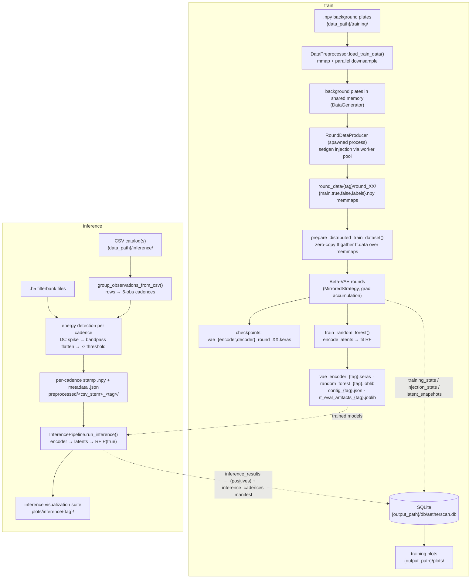

# Architecture

This document is the system-level map of Aetherscan: what the pipeline computes, how the
modules fit together, the process/thread topology, and where every artifact lands on disk.
Per-surface deep dives live in the sibling documents indexed in [`docs/README.md`](README.md); this
one is the place to start when you need to orient yourself in the codebase.

## TL;DR

Aetherscan is a two-stage ML pipeline for SETI anomaly detection in radio spectrograms:

1. A **Beta-VAE** ([`src/aetherscan/models/vae.py`](../src/aetherscan/models/vae.py)) compresses
   each observation spectrogram into an 8-dimensional latent vector, trained with a composite
   loss whose clustering terms teach the latent space to separate ON/OFF-source structure
   (see [`MODELS.md`](MODELS.md)).
2. A **Random Forest** ([`src/aetherscan/models/random_forest.py`](../src/aetherscan/models/random_forest.py))
   classifies whole cadences: the 6 per-observation latents are concatenated into a 48-feature
   vector, and cadences whose P(true) clears `config.inference.classification_threshold`
   become candidates.

Training data are synthetic (setigen signal injection over real observed backgrounds,
[`src/aetherscan/data_generation.py`](../src/aetherscan/data_generation.py)); inference data are
real filterbank `.h5` observations reduced by an energy-detection preprocessing stage
([`src/aetherscan/preprocessing.py`](../src/aetherscan/preprocessing.py)). Both commands run
single-node multi-GPU via `tf.distribute.MirroredStrategy` with NCCL all-reduce (falling back
to `HierarchicalCopyAllReduce`), set up in `setup_gpu_strategy()`
([`src/aetherscan/main.py`](../src/aetherscan/main.py)).

`src/aetherscan/main.py` is the **sole entry point**: `python -m aetherscan.main
{train|inference}`.

## Data model: observations, cadences, stamps, snippets

| Term            | Shape (defaults)                                   | Meaning                                                                                                                                                                                                                                                                                                             |
| --------------- | -------------------------------------------------- | ------------------------------------------------------------------------------------------------------------------------------------------------------------------------------------------------------------------------------------------------------------------------------------------------------------------- |
| **Observation** | `(16, 4096)` raw → `(16, 512)` model-ready         | One spectrogram: `time_bins` × frequency bins. The model input is downsampled ×8 along frequency (`data.width_bin // data.downsample_factor`) and log-normalized into [0, 1].                                                                                                                                       |
| **Cadence**     | `(6, 16, 512)`                                     | 6 observations of the same sky position in ABACAD order: positions 0/2/4 are ON-source ("A"), 1/3/5 are OFF-source ("B", "C", "D"). A technosignature should appear in the ONs and vanish in the OFFs; RFI persists in both, or appears in neither. This is the unit both models reason about.                      |
| **Stamp**       | `(6, 16, stamp_width // downsample_factor)` stored | Inference-side: a `stamp_width` (4096-bin) frequency window cut around one energy-detection hit, extracted from **all 6** observations. Stored downsampled by default (`inference.store_downsampled_stamps`).                                                                                                       |
| **Snippet**     | `(6, 16, 512)`                                     | A stamp after loading (log-normalized, model-ready) — one row of a per-cadence `.npy`. "Stamp" and "snippet" index the same objects; _stamp_ emphasizes the on-disk extraction, _snippet_ the model input. One inference cadence typically yields many snippets (one per deduplicated hit, ×3 with overlap search). |

Physical constants ride along in `DataConfig`: `freq_resolution` ≈ 2.79 Hz/bin,
`time_resolution` ≈ 18.25 s/bin (GBT high-frequency-resolution products).

## Module map

| Module                                                                                                                     | Role                                                                                                                                                                                                                                 |
| -------------------------------------------------------------------------------------------------------------------------- | ------------------------------------------------------------------------------------------------------------------------------------------------------------------------------------------------------------------------------------ |
| [`main.py`](../src/aetherscan/main.py)                                                                                     | Entry point. Initialization order, GPU strategy setup (NCCL warmup + fallback), `train_command()` / `inference_command()` retry loops, streaming per-cadence inference driver, final `manager.cleanup_all()`.                        |
| [`cli.py`](../src/aetherscan/cli.py)                                                                                       | Argparse for both subcommands, semantic + cross-replica validation (`collect_validation_errors`), fix proposer, `apply_saved_config()` / `apply_args_to_config()`. See [`CONFIG_AND_CLI.md`](CONFIG_AND_CLI.md).                     |
| [`config.py`](../src/aetherscan/config.py)                                                                                 | Dataclass-of-dataclasses `Config` singleton; every runtime parameter with a default; `to_dict()` serialization to `config_{tag}.json`.                                                                                               |
| [`train.py`](../src/aetherscan/train.py)                                                                                   | `TrainingPipeline`: curriculum rounds, distributed datasets, gradient accumulation, adaptive LR, checkpointing, the run-state stage machine, and all training diagnostics/plots. See [`TRAINING_PIPELINE.md`](TRAINING_PIPELINE.md). |
| [`round_data.py`](../src/aetherscan/round_data.py)                                                                         | Disk-backed (memmap) per-round datasets: `RoundDataPaths`, the atomic `.done` manifest protocol, and the `RoundDataProducer` background-generation process.                                                                          |
| [`run_state.py`](../src/aetherscan/run_state.py)                                                                           | Persisted `TrainingRunState` manifest (`run_state_{tag}.json`) that drives stage-aware training resume.                                                                                                                              |
| [`data_generation.py`](../src/aetherscan/data_generation.py)                                                               | setigen signal injection: `create_false` / `create_true_single` / `create_true_double`, batched memmap generation (`generate_round_to_memmap`), injection statistics. See [`PREPROCESSING.md`](PREPROCESSING.md).                    |
| [`seeding.py`](../src/aetherscan/seeding.py)                                                                               | Root-seed stream derivation (`derive_rng`/`derive_seed`/`seed_tensorflow` + per-consumer stream ids) making **both** pipelines reproducible from `config.reproducibility.seed` (default 11). See [`TRAINING_PIPELINE.md`](TRAINING_PIPELINE.md).               |
| [`preprocessing.py`](../src/aetherscan/preprocessing.py)                                                                   | Training background loading; inference energy detection (fused per-coarse-channel workers, vectorized D'Agostino-Pearson test, spline/PFB bandpass flattening, stamp extraction). See [`PREPROCESSING.md`](PREPROCESSING.md).        |
| [`pfb.py`](../src/aetherscan/pfb.py)                                                                                       | Polyphase-filterbank static passband response (native NumPy port of the bliss reference) used by the default bandpass-flattening method.                                                                                             |
| [`inference.py`](../src/aetherscan/inference.py)                                                                           | `InferencePipeline`: distributed encoding of snippets, two-pass RF classification (deterministic screen → seeded MC scoring), the reference-cloud reservoir, positives-only result writes. See [`INFERENCE_PIPELINE.md`](INFERENCE_PIPELINE.md).                                                                        |
| [`inference_viz.py`](../src/aetherscan/inference_viz.py)                                                                   | End-of-run inference visualization suite (ED distributions, galleries, candidate uncertainty, latent projection, summary card).                                                                                                                             |
| [`candidate_figures.py`](../src/aetherscan/candidate_figures.py)                                                          | TF-free process-parallel per-candidate figure renderer (#298): forkserver pool with empty preload, shared cadence-strip/annotation helpers. Called by `inference_viz.py`.                                                                                   |
| [`latent_variants.py`](../src/aetherscan/latent_variants.py)                                                               | TF-free latent-representation catalogue (#282): the 8-variant feature builders shared by training's RF sweep and inference's feature rebuild, selection metrics (recall@FPR, ECE, bootstrap minimum-margin winner), and the probability calibrator. See [`MODELS.md`](MODELS.md).                                     |
| [`latent_gif.py`](../src/aetherscan/latent_gif.py)                                                                         | TF-free process-parallel latent-GIF frame renderer (#278): forkserver pool with per-worker figure/artist reuse, byte-identical PNGs across worker counts. Called by `train.py`'s `plot_latent_space_gif`.                             |
| [`models/vae.py`](../src/aetherscan/models/vae.py), [`models/random_forest.py`](../src/aetherscan/models/random_forest.py) | Model definitions. See [`MODELS.md`](MODELS.md).                                                                                                                                                                                     |
| [`rf_metrics.py`](../src/aetherscan/rf_metrics.py)                                                                         | Pure (TF-free) helper `compute_rf_eval_metrics()` — sklearn.metrics-based scalar RF eval metrics that `train.py` persists to `training_stats` (`model_name='rf'`) for the dashboard's RF tab.                                        |
| [`shap_parallel.py`](../src/aetherscan/shap_parallel.py)                                                                   | TF-free process-pool wrapper (`parallel_shap`) chunking the RF SHAP passes across worker processes, each rebuilding a stock `TreeExplainer`. Called by `train.py`. See [`TRAINING_PIPELINE.md`](TRAINING_PIPELINE.md).               |
| [`db/db.py`](../src/aetherscan/db/db.py)                                                                                   | Thread-safe SQLite singleton with a single background writer thread, schema migrations, and supersede semantics. See [`DATABASE.md`](DATABASE.md).                                                                                   |
| [`benchmark.py`](../src/aetherscan/benchmark.py)                                                                           | Always-on stage timing (`stage_timer` / `record_stage`) written to the `pipeline_stages` table. See [`BENCHMARKING.md`](BENCHMARKING.md).                                                                                            |
| [`dashboard.py`](../src/aetherscan/dashboard.py)                                                                           | Standalone Streamlit live-monitoring dashboard read from the run's SQLite DB; ships in-package so any install method can auto-launch it.                                                                                             |
| [`dashboard_launcher.py`](../src/aetherscan/dashboard_launcher.py)                                                         | `launch_dashboard()` spawns the headless Streamlit subprocess (guarded, detached, atexit / SIGTERM teardown).                                                                                                                        |
| [`dashboard_cli.py`](../src/aetherscan/dashboard_cli.py)                                                                   | `aetherscan-dashboard` console script — re-execs `python -m streamlit run` on the packaged dashboard for manual DB inspection against a saved run.                                                                                    |
| [`hf_hub.py`](../src/aetherscan/hf_hub.py)                                                                                 | HuggingFace Hub artifact upload/download with version-coupled revision resolution. See [`RELEASE.md`](RELEASE.md).                                                                                                                   |
| [`tag_guards.py`](../src/aetherscan/tag_guards.py)                                                                         | Fail-early `--save-tag` dedup guards run before any expensive work.                                                                                                                                                                  |
| [`logger/`](../src/aetherscan/logger), [`manager/`](../src/aetherscan/manager), [`monitor/`](../src/aetherscan/monitor)    | Queue-based logging (+ Slack), resource lifecycle management (pools/SHM/processes/signals), 1 Hz resource monitoring. See [`RUNTIME_SERVICES.md`](RUNTIME_SERVICES.md).                                                              |

## Data flow



The train and inference halves share the models, the config/DB/logging infrastructure, and the
preprocessing conventions (downsample ×8 + log-norm) — a snippet at inference time is shaped
exactly like a training cadence.

## Process & thread topology

The main process owns TensorFlow (and therefore the GPUs). Everything CPU-heavy is pushed into
worker processes; everything I/O-ish runs on background threads of the main process:

- **Main process threads**: the TF runtime (its own thread pool), the DB writer thread
  ([`DATABASE.md`](DATABASE.md)), the `QueueListener` logging thread
  ([`RUNTIME_SERVICES.md`](RUNTIME_SERVICES.md)), the 1 Hz resource-monitor thread, the
  round-data drainer thread (training), and a 1-worker preprocessing prefetch thread
  (streaming inference).
- **Worker pools** (fork-started, plain `multiprocessing.Pool`): background
  downsampling (training load), energy detection + stamp extraction (one persistent pool per
  inference run), and signal injection (owned by the producer, below).
- **`RoundDataProducer`** (training only): a **spawn**-started process that owns its own
  injection worker pool and generates round _k+1_ while round _k_ trains. Spawn, not fork —
  the TF-laden parent holds locks a forked child could inherit mid-acquisition
  (see the `_MP_CONTEXT` note in [`round_data.py`](../src/aetherscan/round_data.py)).
- **Shared memory** carries the background plates (training) and load-time chunks; memmapped
  `.npy` files carry everything bigger. Only the creator ever unlinks shared memory; the
  ResourceManager tracks and cleans up all of it.

The DB writer queue is a _thread_ queue — worker **processes** never write to the DB directly.
Stats generated in workers travel back over multiprocessing queues/IPC and are written by
main-process threads.

## Initialization order (`main.py:main()`)

The order is load-bearing — each step depends on the previous:

1. `load_dotenv(find_dotenv())` — `.env` into `os.environ` before any module reads it
   (workers inherit the environment later).
2. `init_config()` — the `Config` singleton; everything else reads it.
3. `setup_argument_parser()` / `parse_args()` — hoisted ahead of `init_logger()` (arg parsing
   has no logger/manager dependency) so the run's effective `--save-tag` is resolved in time to
   name the per-tag log file `aetherscan_{tag}.log`. A pure CLI-syntax error therefore exits
   before any singleton or thread is created.
4. `init_logger(save_tag=…)` — queue-based logging up before anything else wants to log; names
   this run's log file from the tag `resolve_save_tag()` produced in step 3
   (`{command}_{datetime}`, or the loaded tag when resuming in place via `--load-tag`).
5. `init_manager()` — the ResourceManager registers its `atexit` + `SIGINT`/`SIGTERM` handlers.
6. `register_logger()` — hands the logger to the manager so it is stopped **last** during
   cleanup (you can log during teardown of everything else).
7. Inference only: `resolve_inference_artifacts(args)` — downloads / locates the model artifact
   trio (encoder, RF, config JSON) via the HF resolution chain and writes the cached paths onto
   `args`, so `apply_saved_config` and `validate_args` see them as if passed on the CLI.
8. Inference only: `apply_saved_config(args.config_path)` — layers a saved training-run JSON
   under CLI flags _before_ validation, so `validate_args` checks the values inference will
   actually use. The saved `checkpoint` section is skipped (a training run's `save_tag` must
   not leak into an inference run).
9. `validate_args(args)` — semantic + cross-replica divisibility checks; no mutation.
10. `apply_args_to_config(args)` — CLI overrides land on the singleton.
11. `init_db()` — schema creation + migration, writer thread starts.
12. `init_monitor()` — 1 Hz sampling into `system_resources`.
13. `launch_dashboard()` — auto-launch the live monitoring dashboard (opt out with
    `--no-dashboard`); fully guarded, so a missing streamlit or a spawn failure only warns and
    never aborts the run.
14. Dispatch to `train_command()` / `inference_command()`; a `finally` block calls
    `manager.cleanup_all()` so non-daemon threads can't block exit.

Priority order for any parameter: `runtime defaults < loaded config < CLI args`
(see [`CONFIG_AND_CLI.md`](CONFIG_AND_CLI.md)).

## The singleton pattern

`Config`, `Database`, `Logger`, `ResourceManager`, and `ResourceMonitor` are all thread-safe
singletons (double-checked locking in `__new__`, `_initialized` guard in `__init__`, a
`_reset()` teardown hook used by the test suite). The rationale:

- **One authoritative instance per process.** Config values, the DB writer queue, the log
  queue, and the resource registry must be process-global — two `Database` instances would
  mean two writer threads racing on one SQLite file.
- **Import-order freedom.** Any module calls `get_config()` / `get_db()` / `get_manager()` / `get_logger()` / `get_monitor()`
  at _use_ time instead of threading instances through every constructor.
- **Deterministic teardown.** The manager holds references to the others and closes them in
  a strict order (processes → pools → shared memory → monitor → DB → logger).

Rules that follow (also in [`CLAUDE.md`](../CLAUDE.md)): always use the accessors, never
instantiate directly, and never mutate the config post-init from worker threads — reads are
unsynchronized by design, safe only because startup is the single writer.

Worker processes get a **copy** of the parent's singletons via fork (or none at all via
spawn); they must never touch the DB singleton and must route logging through
`init_worker_logging()`.

## Tag conventions

Every run is identified by `config.checkpoint.save_tag` — the **tag** — which stamps every
artifact filename and every DB row. A tag is `{command}_{YYYYMMDD_HHMMSS}`, resolved once at
startup by `cli.resolve_save_tag()` (before `init_logger`, so the log / config / artifacts all
share one datetime):

| On the CLI | Resolves to | Use |
| --- | --- | --- |
| `--save-tag {test\|train\|inf\|bench}` | `{prefix}_{YYYYMMDD_HHMMSS}` | The user supplies only the prefix; the datetime is stamped at run time. |
| `--save-tag` omitted | `{subcommand}_{YYYYMMDD_HHMMSS}` (`train`→`train_…`, `inference`→`inf_…`) | The default label per subcommand. |
| `--load-tag {prefix}_{YYYYMMDD_HHMMSS}` | *(that tag is adopted)* | **Resume in place** — the run continues under the loaded tag (same `run_state` / DB rows / artifacts). |
| `--load-tag round_XX` | *(a fresh save-tag)* | Load a per-round checkpoint (needs `--load-dir checkpoints`; `CheckpointConfig.infer_start_round()` sets the start round to `XX+1`) into a **new** run. |

`round_XX` is the intermediate per-round checkpoint tag and is **load-only** (rejected on
`--save-tag`). There is no cross-run "latest tag" search: on resume, `_resolve_load_tag` loads
the run's own final weights or, failing that, its last completed round (per the manifest) —
never another run's model; it fails loudly instead. **Retries** are first-class: re-run with
`--load-tag {full-tag}` and the run-state manifest (training) / `inference_cadences` manifest
(inference) make it resume in place rather than collide, with stale rows from dead attempts
flagged `superseded` in the DB ([`DATABASE.md`](DATABASE.md)).

## Directory layout & artifact map

Three roots, set by `AETHERSCAN_{DATA,MODEL,OUTPUT}_PATH` (defaults under
`/datax/scratch/zachy/...`; the container binds them 1:1 so absolute paths stay valid):

```
{data_path}/
├── training/                          # background plate .npy files (config.data.train_files)
├── testing/                           # preprocessed test .npy files (config.data.test_files)
└── inference/                         # CSV catalogs (config.data.inference_files)
    └── preprocessed/<csv_stem>_<tag>/ # per-cadence stamp .npy + metadata .json (tag-scoped)

{model_path}/
├── vae_encoder_{tag}.keras            # final encoder (the inference model)
├── vae_decoder_{tag}.keras            # final decoder (needed for latent traversal)
├── random_forest_{tag}.joblib         # final RF classifier (the winning latent variant)
├── random_forest_{tag}_{variant}.joblib   # every variant of the #282 sweep (post-hoc comparison)
├── rf_calibrator_{tag}.joblib         # kept probability calibrator (only calibrated runs)
├── rf_eval_artifacts_{tag}.joblib     # val features/labels/probas consumed by all RF plots
├── rf_shap_values_{tag}.joblib        # cached SHAP values (summary/interaction/log-loss)
├── umap_{obs,cadence}_nn{n}_md{m}_{tag}.joblib   # persisted UMAP projections
└── checkpoints/                       # per-round vae_{encoder,decoder}_round_XX.keras
    └── archive/<timestamp>/           # previous runs' checkpoints, moved aside at startup

{output_path}/
├── config_{tag}.json                  # resolved config snapshot (written by final_save / inference)
├── run_state_{tag}.json               # training run manifest (stage machine + completed rounds)
├── inference_reference_cloud_{tag}.npz # MC-scored survey reference cloud (candidate uncertainty plot)
├── db/aetherscan.db                   # SQLite (WAL) — all stats/results tables
├── logs/aetherscan_{tag}.log          # this run's log (mode="w": overwrites the same tag's log on rerun)
├── cache/pfb/pfb_response_*.npy       # content-addressed PFB passband responses (tag-independent)
├── round_data/{tag}/round_XX/         # per-round training memmaps (deleted after the round trains)
│   └── rf/                            #   plus the RF training dataset
└── plots/
    ├── resource_utilization_{tag}.png # monitor resource plot (mode-agnostic)
    ├── benchmark_report_{tag}.png      # end-of-run resource report (mode-agnostic)
    ├── perband_inference_perf_{tag}.png # per-band ED wall-clock (inference only; same gate)
    ├── training/{tag}/*.png            # end-of-training diagnostics (incl. posterior_collapse_{tag}.png
    │                                   #   and latent_variant_selection_{tag}.png)
    │   └── checkpoints/*_round_XX.png  #   per-round diagnostics (archived like model checkpoints)
    └── inference/{tag}/*.png           # inference viz suite (incl. candidate_uncertainty_{tag}.png)
```

Startup hygiene: `train.py:archive_directory()` moves (fresh run) or copies (resume) existing
checkpoints/plots into `archive/<timestamp>/` and deletes `round_XX`-stamped files at or above
the resume round; `round_data.py:prepare_round_data_dir()` applies the same policy to round
data, except it deletes rather than archives (a round is ~295 GB) and keeps completed rounds
only when their `.done` manifest validates.

## Fault-tolerance model (summary)

Both commands wrap their pipeline in a bounded retry loop (`max_retries`/`retry_delay`,
Pattern C flags — the two modes have independent settings). What makes retries _safe_ is
persistent state, not the loop:

- **Training**: `run_state_{tag}.json` records completed rounds and pipeline stages
  (`vae_rounds → vae_plots → rf_train → rf_plots → final_save`); a rebuilt pipeline skips
  finished work, resumes mid-round-loop from the last checkpoint, and marks stale DB rows
  superseded. Details in [`TRAINING_PIPELINE.md`](TRAINING_PIPELINE.md).
- **Inference**: preprocessing resumes off each cadence's on-disk `.npy`; the inference stage
  resumes off live `status='inferred'` rows in the `inference_cadences` DB manifest. One bad
  cadence never aborts the catalog. Details in
  [`INFERENCE_PIPELINE.md`](INFERENCE_PIPELINE.md).

`KeyboardInterrupt` is never retried — it propagates so the ResourceManager's signal handling
can run cleanup exactly once (double Ctrl-C force-quits;
see [`RUNTIME_SERVICES.md`](RUNTIME_SERVICES.md)).

## Where to go next

- Run/build/debug the container and GPUs: [`GPU_RUNTIME_GUIDE.md`](GPU_RUNTIME_GUIDE.md)
- Add a flag or config field: [`CONFIG_AND_CLI.md`](CONFIG_AND_CLI.md)
- Training internals: [`TRAINING_PIPELINE.md`](TRAINING_PIPELINE.md)
- Inference internals: [`INFERENCE_PIPELINE.md`](INFERENCE_PIPELINE.md)
- Energy detection & signal injection: [`PREPROCESSING.md`](PREPROCESSING.md)
- Model math: [`MODELS.md`](MODELS.md)
- Storage & schema: [`DATABASE.md`](DATABASE.md)
- Logging/cleanup/monitoring: [`RUNTIME_SERVICES.md`](RUNTIME_SERVICES.md)
- Stage timing & benchmarking: [`BENCHMARKING.md`](BENCHMARKING.md)
- Tests: [`TESTING.md`](TESTING.md)
- CI/CD & assistant workflows: [`GITHUB_AUTOMATION.md`](GITHUB_AUTOMATION.md)
- Releases: [`RELEASE.md`](RELEASE.md)
